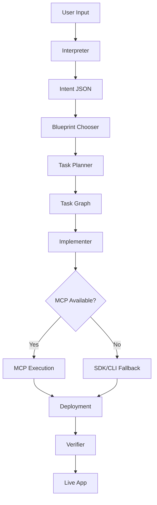

# Layr Architecture

## System Overview

Layr is a meta-layer that transforms natural language descriptions into fully functional applications. It operates through a pipeline of intelligent agents that interpret intent, select appropriate blueprints, provision infrastructure, generate code, and deploy to production.

## Core Components

### 1. Intent Layer (`@layr/core`)

The foundation of the system that defines how user requirements are structured:

- **Intent Schema**: JSON Schema that captures application requirements
- **Blueprint Chooser**: Algorithm that matches intents to appropriate blueprints
- **Validators**: Ensure intent structure is valid and complete

### 2. Agent Layer (`@layr/agent`)

AI-powered orchestration that drives the pipeline:

- **Interpreter Agent**: Converts natural language to structured intent
- **Planner Agent**: Creates task graphs for implementation
- **Implementer Agent**: Executes tasks using MCP or SDK/CLI
- **Verifier Agent**: Validates deployment and functionality

### 3. Integration Layer (`@layr/mcp`)

Unified adapters for service provisioning:

- **MCP Client**: Attempts to use Model Context Protocol servers
- **SDK Fallback**: Falls back to official SDKs when MCP unavailable
- **CLI Fallback**: Final fallback to command-line tools

Supported services:
- Vercel (deployment, hosting)
- Supabase (database, auth)
- Clerk (authentication)
- Stripe (payments)

### 4. Interface Layer

Multiple ways to interact with Layr:

- **CLI (`@layr/cli`)**: Command-line interface for developers
- **Web UI (`@layr/ui`)**: Visual builder for non-technical users
- **API**: Programmatic access for integrations

## Blueprint System

Blueprints are pre-configured application templates:

```
blueprints/
├── saas-starter/       # Full SaaS with payments
├── form-to-db/         # Simple data collection
├── community-mini/     # Social platform
├── marketplace-lite/   # Two-sided marketplace
└── static-landing/     # Marketing pages
```

Each blueprint contains:
- `blueprint.json`: Configuration and metadata
- `templates/`: Component templates with placeholders
- `migrations/`: Database schema
- `package.json`: Dependencies

## Execution Pipeline



## Task Graph

Tasks are executed in dependency order:

1. **init_repo**: Initialize project structure
2. **provision_backends**: Set up Supabase, Clerk, Stripe
3. **config_env**: Configure environment variables
4. **scaffold_pages**: Generate application code
5. **commit_preview**: Create git commit
6. **deploy_prod**: Deploy to Vercel
7. **verify_smoke**: Run smoke tests

## MCP Integration

The system prefers MCP servers when available but gracefully falls back:

```typescript
// Execution strategy
async executeTask(task) {
  if (mcpAvailable) {
    try {
      return await mcpClient.execute(task)
    } catch {
      // Fall back to SDK
    }
  }

  if (sdkAvailable) {
    return await sdk.execute(task)
  }

  // Final fallback to CLI
  return await cli.execute(task)
}
```

## Security Considerations

- **Environment Variables**: Never committed, stored in `.env.local`
- **API Keys**: Prefixed with `LAYR_` to avoid conflicts
- **Row Level Security**: Enabled by default on Supabase
- **Authentication**: Clerk integration for secure user management

## Performance

- **Parallel Provisioning**: Backend services provisioned concurrently
- **Cached Blueprints**: Templates cached for faster generation
- **Incremental Deployment**: Only changed files deployed
- **Progressive Enhancement**: Basic features first, advanced later

## Extensibility

### Adding New Blueprints

1. Create directory under `blueprints/`
2. Add `blueprint.json` configuration
3. Create templates with placeholders
4. Add migrations for database schema

### Adding New Services

1. Create adapter in `@layr/mcp`
2. Extend `BaseAdapter` class
3. Implement MCP and SDK/CLI fallbacks
4. Add to `AdapterFactory`

### Custom Agents

1. Add prompt in `@layr/agent/prompts/`
2. Extend task types in core
3. Update task graph executor
4. Add verification logic